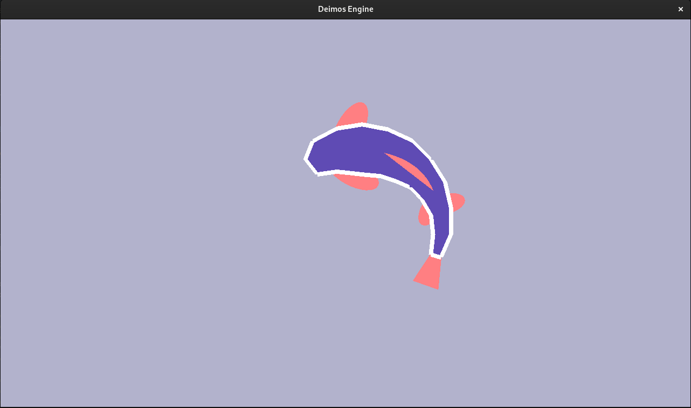

# Procedurally animated fish
The fish in this project follows your cursor and is procedurally animated, providing a dynamic interaction.

## Build
1. Run the `build.sh` script. This script will:
    - fetch all necessary dependencies, including the Deimos engine
    - configure and compile the project
 ```
 ./build.sh
 ```
 2. Run the project
 ```
 ./build/Sandbox/Sandbox
```